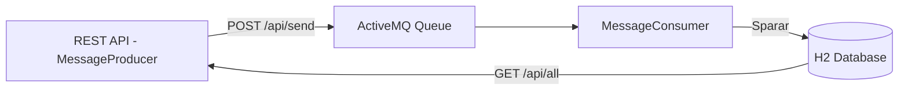

# Spring Boot Integration – ICC Demo

Ett professionellt och tekniskt genomarbetat demo-projekt som visar modern systemintegration med Spring Boot, ActiveMQ, H2 och CI/CD via GitHub Actions. Projektet är inspirerat av ett verkligt integrationsscenario och syftar till att vidareutveckla mina kunskaper inom DevOps, automatisering och integration mellan mikrotjänster.

## Funktionalitet

- REST API för att skicka och hämta meddelanden
- ActiveMQ (JMS) för asynkron meddelandehantering
- Persistens med H2 in-memory databas
- JSON-strukturerad loggning med Logback + MDC
- Enhetstester med JUnit + Mockito (94% täckning via JaCoCo)
- Fullständig CI/CD-pipeline med GitHub Actions
- Dockeriserad med Compose och körbar både lokalt och i CI/CD

## Arkitekturöversikt



## Teknologier

| Teknologi             | Användning                             |
|-----------------------|----------------------------------------|
| Spring Boot 3.3.2     | Huvudramverk                           |
| ActiveMQ              | Meddelandekö (JMS)                     |
| H2 Database           | In-memory databas för test och logg    |
| Spring Data JPA       | Hantering av entiteter och datalagring |
| JUnit + Mockito       | Enhetstester                           |
| JaCoCo                | Kodtäckningsrapport                    |
| Logback + MDC         | Strukturerad loggning i JSON-format    |
| GitHub Actions        | CI/CD-pipeline                         |
| Docker + Compose      | Paketering och lokal drift             |
| Postman               | Test av REST API:er                    |

## API Endpoints (testade i Postman och curl)

### Skicka ett meddelande

```http
POST /api/send?message=HejIntegration
```

**Svar:**
```
Meddelande skickat till kön: HejIntegration
```

### Hämta alla meddelanden

```http
GET /api/all
```

**Svar:**
```json
[
  {
    "content": "HejIntegration",
    "receivedAt": "2025-07-27T12:34"
  }
]
```

## Test och kodtäckning

Kör tester och generera täckningsrapport:

```bash
mvn clean verify
```

Öppna rapporten:

```
target/site/jacoco/index.html
```

**Täckning:** 94% (visas i `target/site/jacoco/index.html`)

## Loggning och testresultat

Loggar genereras i JSON-format och sparas i:

```
logs/app.log
```

Exempel:

```json
{
  "@timestamp": "2025-07-28T02:05:16.735+02:00",
  "level": "INFO",
  "message": "Meddelande skickat till kön: HejIntegration",
  "logger_name": "com.igorgomes.integration.MessageProducer",
  "messageId": "uuid..."
}
```

## Bygga och köra lokalt

```bash
git clone https://github.com/ditt-anvandarnamn/spring-boot-integration.git
cd spring-boot-integration

mvn clean install
mvn spring-boot:run
```

Testa i webbläsaren eller med Postman:

- http://localhost:8080/api/send?message=HejIntegration
- http://localhost:8080/api/all

## Docker: Bygg och kör med Compose

```bash
docker compose up --build
```

Applikationen körs då på: http://localhost:8080  
ActiveMQ-konsolen finns på: http://localhost:8161 (användare: admin / lösenord: admin)

## Continuous Integration (CI)

Projektet använder **GitHub Actions** för att automatiskt bygga, testa och containerisera applikationen. Pipelines körs automatiskt vid `push` eller `pull request` som riktas mot `main` eller `test` branchen.

Workflowen omfattar följande steg:

- Checkar ut källkoden
- Sätter upp JDK 17
- Cacherar Maven-beroenden
- Bygger projektet med Maven
- Kör tester och genererar kodtäckningsrapport (JaCoCo)
- Laddar upp JaCoCo-rapporten som artefakt
- Bygger Docker-image av applikationen

```yaml
# .github/workflows/ci.yaml

name: Java CI with Maven and Docker

on:
  push:
    branches: [ main, test ]
  pull_request:
    branches: [ main, test ]

jobs:
  build:
    runs-on: ubuntu-latest

    steps:
      - name: Check out code
        uses: actions/checkout@v4

      - name: Set up JDK 17
        uses: actions/setup-java@v4
        with:
          java-version: '17'
          distribution: 'temurin'

      - name: Cache Maven dependencies
        uses: actions/cache@v4
        with:
          path: |
            ~/.m2/repository
          key: ${{ runner.os }}-maven-${{ hashFiles('**/pom.xml') }}
          restore-keys: |
            ${{ runner.os }}-maven-

      - name: Build with Maven
        run: mvn clean install

      - name: Run tests and generate coverage report
        run: mvn verify

      - name: Upload JaCoCo report
        if: success()
        uses: actions/upload-artifact@v4
        with:
          name: jacoco-report
          path: target/site/jacoco

      - name: Build Docker image
        run: docker build -t igorgomes/spring-boot-integration:latest .

```

## JavaDoc

JavaDoc kan enkelt genereras via verktygsmenyn i IntelliJ IDEA eller med kommandot `mvn javadoc:javadoc` (om Maven är installerat globalt).

Ingår inte i CI/CD-flödet för att undvika onödig belastning.
```

## Projektstruktur

```
.
├── .gitignore
├── README.md
├── pom.xml
├── Dockerfile
├── docker-compose.yaml
├── src/
├── logs/
└── .github/

```

---

**Utvecklad av:** Igor Gomes – DevOps Engineer med fokus på integration och CI/CD  
**LinkedIn:** [https://www.linkedin.com/in/igor-lopes-gomes-5b6184290]
