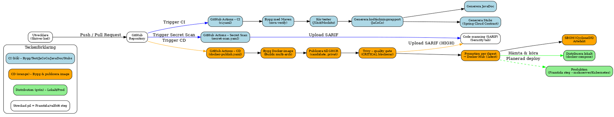

# Spring Boot Integration – ICC Demo  

[](https://github.com/IgorGomes01/spring-boot-integration/actions/workflows/ci.yaml)
[](https://github.com/IgorGomes01/spring-boot-integration/actions/workflows/docker-publish.yaml)
[](https://hub.docker.com/r/igor88gomes/spring-boot-integration/tags)

> Av Igor Gomes — DevOps Engineer

<p align="center">
  
</p>
<p align="center"><em><strong>Bild 1.</strong> Arkitekturöversikt – Spring Boot, ActiveMQ och PostgreSQL.</em></p>

<p align="center">
  
</p>
<p align="center"><em><strong>Bild 2.</strong> CI/CD-pipeline – bygg, test (JaCoCo/JavaDoc) och publicering till Docker Hub.</em></p>

## Projektinformation

Detta projekt visar en komplett integrationslösning inspirerad av ICC-mönster, utvecklad från grunden med 
moderna teknologier och etablerade arkitekturmönster. Lösningen kombinerar asynkron kommunikation, 
spårbarhet, testbarhet och fullständig automatisering genom CI/CD-pipelines och Docker-baserad 
distribution.

Applikationen är byggd med Java och Spring Boot 3, och använder ActiveMQ (JMS) för meddelandehantering, 
PostgreSQL för datalagring samt Docker för containerisering. CI/CD-pipelines implementeras med GitHub 
Actions och publicerar automatiskt applikationsimagen till Docker Hub.

Loggningen är strukturerad i JSON-format med Logback och Logstash Encoder och skrivs både till konsol
(stdout) och roterande loggfiler.

Två separata pipelines hanterar applikationens CI/CD-flöde:

- **(CI)** `ci.yaml` validerar, bygger (Maven), testar (med H2 in-memory databas i CI-miljö för 
  enkelhet och isolerade tester) och genererar kodtäckningsrapport (JaCoCo) vid ändringar som pushas
  till brancherna `main` och `test`. JaCoCo-rapporten publiceras som **artefakt** i varje CI-körning
  och kan laddas ner från Actions-sidan. På `main` genereras även JavaDoc och publiceras som artefakt.

- **(CD)** `docker-publish.yaml` bygger och publicerar applikationsimagen till Docker Hub vid push till 
  `main` *(taggar `latest` och `<commit-SHA>` för spårbarhet)*.

För en översiktlig bild av pipelinen/pipelineflödet, se **Bild 2**. 

För flera detaljer om pipelinen, se:

- [.github/workflows/ci.yaml](.github/workflows/ci.yaml)
- [.github/workflows/docker-publish.yaml](.github/workflows/docker-publish.yaml)
- [docs/USAGE.md#ci-artifacts](docs/USAGE.md#ci-artifacts)

**Sammanfattning:** Lösningen körs i containers med asynkrona köer (ActiveMQ), persistens (PostgreSQL) och
spårbar JSON-loggning. Lokalt startas stacken med **Docker Compose**, och **CI/CD i GitHub Actions**
automatiserar bygg och publicering av applikationsimagen samt kör automatiska tester i CI med en 
in-memory **H2**-databas för snabb återkoppling i en isolerad testmiljö.

---

## Arkitektur & korrelation (översikt)

Se **Bild 1** ovan. Diagrammet visar den asynkrona, meddelandebaserade integrationsarkitekturen i 
applikationen.

1. Klienten (t.ex. Postman eller curl) skickar ett meddelande via REST-endpointen `/api/send`.

2. `MessageProducer` publicerar meddelandet till en ActiveMQ-kö.

3. `MessageConsumer` lyssnar på kön och lagrar meddelandet i PostgreSQL-databasen.

4. Klienten kan hämta alla sparade meddelanden via `/api/all`, vilket anropar `MessageController` och 
   hämtar data med hjälp av JPA.

> Arkitekturen möjliggör spårbar och tillförlitlig kommunikation i en modulär och lättunderhållen lösning.

### Affärs-API (REST)

| Metod | Endpoint                 | Beskrivning                    |
|------:|--------------------------|--------------------------------|
| POST  | `/api/send?message=TEXT` | Skicka meddelande till kön     |
| GET   | `/api/all`               | Hämta alla sparade meddelanden |

```bash
# Exempel (Affärs-API)
curl -X POST "http://localhost:8080/api/send?message=TestIntegration"
curl http://localhost:8080/api/all
```
> **Validering:** `POST /api/send` returnerar **400 (Bad Request)** om parametern `message` är tom eller endast blanktecken (*whitespace*).

```bash
# Exempel: parametern `message` är tom/blank
curl -i -X POST http://localhost:8080/api/send -d "message= "
```

### Övervakning (Actuator-API)

| Metod | Endpoint            | Beskrivning            |
|------:|---------------------|------------------------|
| GET   | `/actuator/health`  | Hälsa/status för appen |

```bash
# Exempel (health)
curl http://localhost:8080/actuator/health 
```

## Spårbarhet & korrelations-ID

### Loggexempel

**Affärs-anrop:**
```bash
curl -X POST "http://localhost:8080/api/send?message=TestIntegration"
```

**`logs/app.log`**

```json
[
  {
    "@timestamp": "2025-08-28T21:39:27.407+02:00",
    "level": "INFO",
    "logger_name": "com.igorgomes.integration.MessageProducer",
    "message": "Skickar meddelande till kön: TestIntegration",
    "messageId": "03c5e1af-e53d-4a9c-890c-1259457ca6bd"
  },
  {
    "@timestamp": "2025-08-28T21:39:27.504+02:00",
    "level": "INFO",
    "logger_name": "com.igorgomes.integration.MessageConsumer",
    "message": "Meddelande mottaget från kön: TestIntegration",
    "messageId": "03c5e1af-e53d-4a9c-890c-1259457ca6bd"
  }
]

```
> Exemplet visar end-to-end-korrelation: producenten skickar `messageId` i **JMS-headern** och konsumenten läser headern och sätter samma `messageId` i MDC. Därmed kan samma ID följas genom hela flödet.

### Korrelationsflöde (MDC + JMS)
- **Controller**: Säkerställer att `messageId` finns i MDC för varje anrop; skapar UUID om det saknas och tar bort nyckeln i `finally` endast om den sattes här.
- **Producer**: Läser `messageId` från MDC och skickar som **JMS-header**; rör inte MDC.
- **Consumer**: Läser headern `messageId`, lägger in i MDC under bearbetning för loggkorrelation och tar bort just den nyckeln i `finally`.

Detta gör att samma `messageId` kan följas från HTTP-ingången, via kön, till persistens. 
Se [docs/USAGE.md](docs/USAGE.md) för fler detaljer och körningskommandon.

### Tester (korrelationskontrakt)
- Producer sätter `messageId` som JMS-header när MDC har värde; annars inte.
- Controller ser till att `messageId` finns i MDC för `/api/send`.
- Se `MessageProducerTest` för fallen *MDC present* och *MDC missing*.

Se [docs/TESTS.md](docs/TESTS.md) för fler detaljer.

## Funktionalitet

- Exponerar REST API med Spring Boot
- Hanterar asynkron meddelandeöverföring med ActiveMQ (JMS)
- Lagrar persistent data i PostgreSQL via JPA
- Loggar i JSON-format med Logback + MDC
- Kör enhetstester med JUnit 5 och Mockito
- Kör automatiska tester i CI-miljö med H2-databas
- Körs i containeriserad miljö via Docker Compose

## Teknologier

| Teknologi         | Användning                                    |
|-------------------|-----------------------------------------------|
| Spring Boot 3.3.2 | Huvudramverk                                  |
| ActiveMQ          | Meddelandekö (JMS)                            |
| H2 Database       | In-memory databas för automatiska tester i CI |
| PostgreSQL        | Databashanterare via JPA (containermiljö)     |
| Spring Data JPA   | Hantering av entiteter och datalagring        |
| Logback + MDC     | Strukturerad loggning i JSON-format           |
| JUnit + Mockito   | Enhetstester                                  |

## Körning (Runtime)

**Hela stacken körs containeriserad med Docker Compose** (stöd för Podman Compose):
    
- `integration-app` – applikationen (image: `igor88gomes/spring-boot-integration:latest`, **byggs och
   pushas av CD-pipelinen**)
- `activemq` – ActiveMQ (JMS)
- `postgres` – PostgreSQL
**Java 17 ingår i applikationsimagen; inget lokalt JDK krävs.**

### Bygg / CI & dokumentation (GitHub Actions)

- **Workflow:** `.github/workflows/ci.yaml`
- **Trigger:** push/PR till `main` och `test`
- **Steg:** Maven-bygge och tester
- **Artefakter:** `jacoco-report` (main/test), `javadoc` (endast `main`)

### Distribution (CD) (GitHub Actions)

- **Workflow:** `.github/workflows/docker-publish.yaml`
- **Trigger:** push till `main`  *(ej PR)*
- **Publicering:** bygger och publicerar applikationsimagen till Docker Hub
- **Taggar:** `latest` + `<commit-SHA>`
- **Register:** `igor88gomes/spring-boot-integration`   
*(Standardtaggen är `latest` om inget anges; varje build taggas även med `<commit-SHA>` för spårbarhet.)*

## Projektstruktur

```text
spring-boot-integration/
│
├── src/                    # Java-källkod & tester
├── pom.xml                 # Maven-konfiguration
├── Dockerfile              # Bygg applikationens Docker-image
├── docker-compose.yaml     # Lokalt orkestreringsstöd (app, ActiveMQ, PostgreSQL)
├── .github/workflows/      # CI/CD-pipelines (ci.yaml, docker-publish.yaml)
└── docs/                   # Dokumentation & bilder

```

## Relaterade dokument

- **Användning:** [docs/USAGE.md](docs/USAGE.md)  
- **Utvecklingsresa:** [docs/PROJECT_HISTORY.md](docs/PROJECT_HISTORY.md)  

## Kontakt

Igor Gomes — DevOps Engineer  
[LinkedIn](https://www.linkedin.com/in/igor-gomes-5b6184290) · [Docker Hub](https://hub.docker.com/r/igor88gomes/spring-boot-integration/tags)  
**E-post:** [igor88gomes@gmail.com](mailto:igor88gomes@gmail.com)