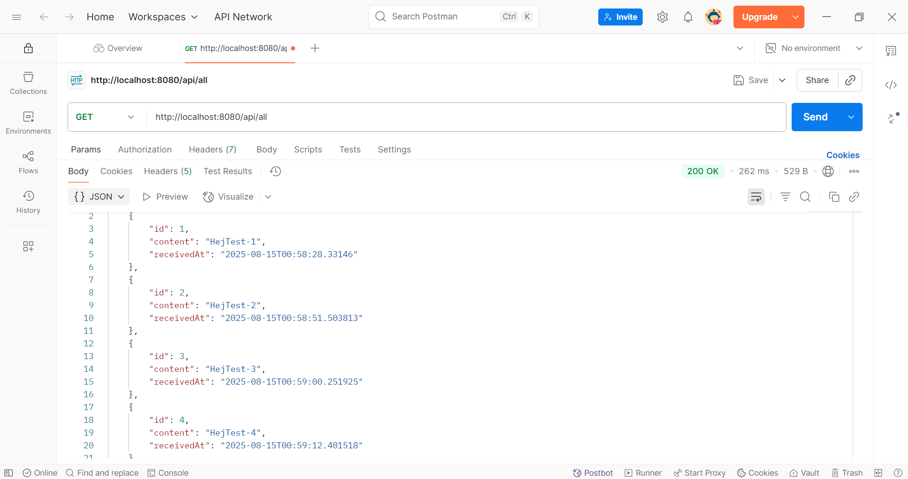

# Användarguide

## Förutsättningar

Innan du börjar, se till att följande är installerat på systemet:

- **Docker** och **Docker Compose**  
  *eller*
- **Podman** och **Podman Compose**

Instruktionerna nedan använder **Docker** som standard.  
Om du använder **Podman**, ersätt helt enkelt `docker` med `podman` och  
`docker compose` med `podman-compose`.

> **Obs!** Vill du köra tester lokalt utan Docker?
> Se [docs/TESTS.md](docs/TESTS.md#kör-tester-lokalt).

---

## Snabbstart

### 1) Klona projektet

```bash
git clone https://github.com/igor88gomes/spring-boot-integration.git
cd spring-boot-integration
```

### 2) Kopiera mallfilen `.env.example` till en lokal `.env` (obligatoriskt för att starta stacken) 

```bash
cp .env.example .env
```

> Rekommenderat: fyll i skarpa värden i .env för ökad säkerhet (ignoreras av Git). I övrigt räcker kopieringen från `.env.example` till `.env`

### 3) Bygg och starta stacken (app + ActiveMQ + PostgreSQL)

```bash
docker compose up --build -d
```

### 4) Kontrollera körande containrar

```bash
docker ps
```

### 5) Stoppa och rensa nätverk/containers

```bash
docker compose down
```

---

## Testa API:erna

Du kan testa API:erna med **curl** (CLI) eller **Postman** (GUI).  
GET-endpoints kan även öppnas direkt i webbläsaren.

Tjänsterna är tillgängliga via `http://localhost:PORT` om portarna är exponerade.

### Med curl (CLI)

```bash
# Skicka meddelande
curl -X POST "http://localhost:8080/api/send?message=HejTest"

# Hämta alla meddelanden
curl "http://localhost:8080/api/all"

# Hälsa
curl "http://localhost:8080/actuator/health"
```

**Tips:** Verktyget **jq** kan installeras för att formatera och färgmarkera JSON-data direkt i terminalen.  
Det gör både API-svar och loggfiler enklare att läsa, men är helt valfritt.

**Exempelanvändning med API-svar:**

 ```bash
curl http://localhost:8080/actuator/health | jq
```
```json
{
  "status": "UP",
  "components": {
    "db": {
      "status": "UP",
      "details": {
        "database": "PostgreSQL",
        "validationQuery": "isValid()"
      }
    },
    "diskSpace": {
      "status": "UP",
      "details": {
        "total": 1081101176832,
        "free": 1016195850240,
        "threshold": 10485760,
        "path": "/app/.",
        "exists": true
      }
    },
    "jms": {
      "status": "UP",
      "details": {
        "provider": "ActiveMQ"
      }
    },
    "ping": {
      "status": "UP"
    }
  }
}

```
**Obs: validering:** Följande anrop ska ge **400**:
```bash
curl -i -X POST "http://localhost:8080/api/send?message=%20%20%20"  # URL-enkodat whitespace
# alt:
curl -i -X POST http://localhost:8080/api/send -d "message=   "     # form body
```

### Med Postman (GUI)

1. Öppna Postman.
2. Anropa:
    - **GET** `http://localhost:8080/actuator/health`
    - **GET** `http://localhost:8080/actuator/info`
    - **POST** `http://localhost:8080/api/send?message=HejTest`
    - **GET** `http://localhost:8080/api/all`

<p align="center">
  
</p>
<p align="center"><em><strong>Bild 3.</strong> Exempel på GET <code>/api/all</code> i Postman som visar alla lagrade meddelanden.</em></p>

> Tips: Skapa en liten **collection** i Postman med ovan fyra requests för snabb regressionstest.

## Loggar och spårbarhet

Applikationen loggar i **JSON-format** (Logback + MDC) direkt till **stdout**.  
I container-miljö läses loggar via `docker logs`.

### Visa loggar Exempel

**Som JSON (med jq):**
```bash
docker logs integration-app | jq

```
**Råa loggar (utan jq):**
```bash
docker logs integration-app
```

### Verifiera end-to-end-korrelation i loggar (samma `messageId`)

**1) Skicka några testmeddelanden**

```bash
curl -X POST "http://localhost:8080/api/send?message=Test-1"
```

**2) Filtrera enbart producentens loggar (timestamp, message, messageId)**

```bash
docker logs integration-app \
  | jq -R 'fromjson? | select(.)' \
  | jq -r 'select(.logger_name=="com.igorgomes.integration.MessageProducer")
           | [.["@timestamp"], .message, .messageId] | @tsv'
```

Exempelutdata (1 sep 2025):

```text
2025-09-01T00:49:26.818886199+02:00     Aktiv kö (konfiguration): test-queue
2025-09-01T00:51:54.187148005+02:00     Skickar meddelande till kön: Test-1     50de7a3b-b8e0-4fe6-8497-3663012fe7e5
2025-09-01T00:51:54.412839282+02:00     Meddelandet skickades framgångsrikt!    50de7a3b-b8e0-4fe6-8497-3663012fe7e5
2025-09-01T00:52:02.644401358+02:00     Skickar meddelande till kön: Test-2     244fb974-76a0-422e-9dde-248e1ea536cb
2025-09-01T00:52:02.669139559+02:00     Meddelandet skickades framgångsrikt!    244fb974-76a0-422e-9dde-248e1ea536cb
2025-09-01T00:52:09.308283094+02:00     Skickar meddelande till kön: Test-3     ee36e1c6-bbce-4e7e-b4eb-3efa31a8dfec
2025-09-01T00:52:09.325314642+02:00     Meddelandet skickades framgångsrikt!    ee36e1c6-bbce-4e7e-b4eb-3efa31a8dfec
```

**3) Filtrera enbart konsumentens loggar (timestamp, message, messageId)**

```bash
docker logs integration-app \
  | jq -R 'fromjson? | select(.)' \
  | jq -r 'select(.logger_name=="com.igorgomes.integration.MessageConsumer")
           | [.["@timestamp"], .message, .messageId] | @tsv'
```

Exempelutdata (1 sep 2025):

```text
2025-09-01T00:51:54.4817882+02:00       Meddelande mottaget från kön: Test-1    50de7a3b-b8e0-4fe6-8497-3663012fe7e5
2025-09-01T00:51:54.775159808+02:00     Meddelande sparat i databasen!          50de7a3b-b8e0-4fe6-8497-3663012fe7e5
2025-09-01T00:52:02.650607228+02:00     Meddelande mottaget från kön: Test-2    244fb974-76a0-422e-9dde-248e1ea536cb
2025-09-01T00:52:02.667178526+02:00     Meddelande sparat i databasen!          244fb974-76a0-422e-9dde-248e1ea536cb
2025-09-01T00:52:09.312866768+02:00     Meddelande mottaget från kön: Test-3    ee36e1c6-bbce-4e7e-b4eb-3efa31a8dfec
2025-09-01T00:52:09.323411022+02:00     Meddelande sparat i databasen!          ee36e1c6-bbce-4e7e-b4eb-3efa31a8dfec
```

## Databasåtkomst (PostgreSQL)

Öppna en psql-session i Postgrescontainern:

```bash
docker exec -it postgres psql -U integration -d integrationdb
```
Kör exempel-fråga:

```sql
SELECT * FROM message_entity;
```
Avsluta: 

```sql
\q
```